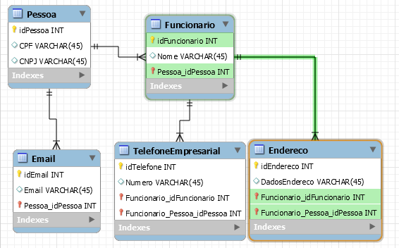

# 4. Projeto da Solução

<span style="color:red">Pré-requisitos: <a href="03-Modelagem do Processo de Negocio.md"> Modelagem do Processo de Negocio</a></span>

---
**ARQUITETURA DO SOFTWARE**
## 4.1. Arquitetura da Solução

A arquitetura da solução segue o modelo cliente → BaaS (Backend as a Service), utilizando React Native no desenvolvimento do aplicativo mobile e Firebase como provedor de serviços backend, garantindo simplicidade, escalabilidade e baixo custo de manutenção.

**Organização dos Componentes**

A solução é composta por três principais camadas/componentes:

**1. Dispositivo Móvel**

Representa o ambiente onde o aplicativo é executado (celulares Android ou iOS).

O usuário interage com o app através de uma interface intuitiva desenvolvida em React Native.

Todas as ações do usuário (cadastro, consulta, atualização, exclusão de dados) são processadas pelo aplicativo, que se comunica diretamente com o Firebase por meio da internet.

**2. Aplicativo Mobile (React Native + Expo)**

Desenvolvido com React Native e gerenciado pelo Expo, o aplicativo oferece uma experiência fluida e multiplataforma.
Dentro do app existem módulos internos que organizam as funcionalidades principais:

Módulos Internos:

- Cadastro de Doadores: permite registrar informações sobre pessoas que doam itens.

- Cadastro de Clientes: armazena os dados de pessoas que recebem ou compram os itens.

- Cadastro de Itens Doado: controla os produtos recebidos, incluindo descrição, categoria, quantidade e imagens.

- Relatórios e Estoque: gera visualizações e resumos das doações, movimentações e estoque disponível.

Toda a lógica de interface e parte das validações de dados são executadas no próprio app, que envia e recebe informações do Firebase.

**3. Firebase (Backend as a Service - BaaS)**

O Firebase é responsável por toda a infraestrutura de backend, oferecendo serviços prontos para autenticação, banco de dados e armazenamento.

Os principais serviços utilizados:

Firebase Authentication:
responsável por gerenciar o registro e login de usuários, permitindo autenticação por e-mail e senha.
Garante a segurança dos acessos e protege as rotas internas do app.

Firebase Firestore (Realtime Database):
armazena todas informações do sistema, como dados de doadores, clientes, itens e transações.
O Firestore é um banco de dados NoSQL em nuvem que permite leitura e escrita em tempo real, facilitando a sincronização automática entre os dispositivos conectados.

Firebase Storage:
responsável pelo armazenamento de imagens dos itens doados.
As imagens são enviadas diretamente do app e associadas aos registros do banco de dados.

Comunicação entre os Módulos:

A comunicação entre os componentes ocorre de forma direta e segura via SDKs oficiais do Firebase para React Native. Tendo o seguinte fluxo:

- O usuário interage com o aplicativo mobile em seu dispositivo;

- O aplicativo, por meio de funções assíncronas e chamadas às APIs do Firebase, envia e recebe dados via Internet;

- O Firebase processa as solicitações e retorna os resultados (autenticação, dados, imagens);

- O app exibe as informações atualizadas para o usuário, sem necessidade de um backend intermediário.

Essa arquitetura elimina a necessidade de um servidor próprio, pois o Firebase centraliza toda a parte de backend (autenticação, banco de dados e storage), enquanto o React Native concentra a interface e a lógica de interação do usuário.

Diagrama:
 
 
---
**MODELAGEM VISUAL DAS TELAS**

## 4.2. Wireframe / Mockup

Wireframe e Mockup são representações visuais das telas de um sistema **antes** do desenvolvimento do código.  
Eles ajudam a planejar, comunicar ideias e validar a interface com antecedência.

### Finalidade
- **Planejamento da interface** → organizar elementos (botões, menus, campos, imagens) e definir a estrutura de navegação.  
- **Comunicação da ideia** → facilitar o diálogo entre desenvolvedores, designers, clientes e usuários.  
- **Validação antecipada** → coletar feedback antes de investir tempo e recursos na programação.  
- **Guia para desenvolvimento** → servir como referência visual durante a implementação.

💡 **_Diferença:_**
- **Wireframe** → simples, sem cores ou imagens detalhadas; foca na estrutura e posicionamento.  
- **Mockup** → mais próximo do visual final, com cores, fontes e imagens, mas sem interatividade completa.

**Exemplo de wireframe:**


📌 **Entrega:** incluir imagens ou links para os wireframes/mockups.

**Wireframe 1 — Tela login/cadastro**  


**Wireframe 2 — Telas principais**  


**Wireframe 3 — Telas de Relatórios**  


---
**UML**

## 4.3 Diagrama de Classes

O diagrama de classes ilustra graficamente como será a estrutura do software, e como cada uma das classes da sua estrutura estarão interligadas. Essas classes servem de modelo para materializar os objetos que executarão na memória.

As referências abaixo irão auxiliá-lo na geração do artefato “Diagrama de Classes”.

> - [Diagramas de Classes - Documentação da IBM](https://www.ibm.com/docs/pt-br/rational-soft-arch/9.6.1?topic=diagrams-class)
> - [O que é um diagrama de classe UML? | Lucidchart](https://www.lucidchart.com/pages/pt/o-que-e-diagrama-de-classe-uml)

---

**BANCO DE DADOS**

## 4.4. Modelo de Dados

A solução proposta exige um banco de dados capaz de armazenar e relacionar as informações necessárias para os processos mapeados, garantindo integridade e controle de acesso por perfil de usuário.

O desenvolvimento deve seguir **três etapas**:

---

### 4.4.1 Diagrama Entidade-Relacionamento (DER)

O **Diagrama Entidade-Relacionamento (DER)** descreve as entidades, atributos e relacionamentos do sistema.  
Utilize a ferramenta **[BR Modelo Web](https://www.brmodeloweb.com/lang/pt-br/index.html)** para criar o diagrama.

**Orientações:**
- Todas as entidades devem possuir chave primária.
- Relacionamentos devem estar corretamente cardinalizados.
- O diagrama deve contemplar todas as funcionalidades levantadas nos processos de negócio.

**Exemplo de imagem:**


📌 **Entrega:** gere o diagrama no BR Modelo, exporte em **.png** e inclua-o nesta seção.


---

### 4.4.2 Esquema Relacional

O **Esquema Relacional** converte o Modelo ER para tabelas relacionais, incluindo chaves primárias, estrangeiras e restrições de integridade.  
Utilize o **[MySQL Workbench](https://www.mysql.com/products/workbench/)** para gerar o diagrama de tabelas (Modelo Lógico).

**Orientações:**
- Inclua todos os atributos das entidades.
- Defina tipos de dados adequados para cada campo.
- Configure as restrições de integridade (NOT NULL, UNIQUE, FOREIGN KEY, etc.).

📌 **Entrega:** exporte o diagrama do Workbench e adicione a imagem aqui.

**Exemplo de imagem:**



---

### 4.4.3 Modelo Físico

O **Modelo Físico** é o script SQL que cria as tabelas no banco de dados.  
Este script pode ser gerado automaticamente no MySQL Workbench a partir do esquema relacional.

**Exemplo:**
```sql
CREATE TABLE Medico (
    MedCodigo INT PRIMARY KEY,
    MedNome VARCHAR(100) NOT NULL
);

CREATE TABLE Paciente (
    PacCodigo INT PRIMARY KEY,
    PacNome VARCHAR(100) NOT NULL
);

CREATE TABLE Consulta (
    ConCodigo INT PRIMARY KEY,
    MedCodigo INT,
    PacCodigo INT,
    Data DATE,
    FOREIGN KEY (MedCodigo) REFERENCES Medico(MedCodigo),
    FOREIGN KEY (PacCodigo) REFERENCES Paciente(PacCodigo)
);

CREATE TABLE Medicamento (
    MdcCodigo INT PRIMARY KEY,
    MdcNome VARCHAR(100) NOT NULL
);

CREATE TABLE Prescricao (
    ConCodigo INT,
    MdcCodigo INT,
    Posologia VARCHAR(200),
    PRIMARY KEY (ConCodigo, MdcCodigo),
    FOREIGN KEY (ConCodigo) REFERENCES Consulta(ConCodigo),
    FOREIGN KEY (MdcCodigo) REFERENCES Medicamento(MdcCodigo)
);
```
## 📌ATENÇÃO: salvar como banco.sql na pasta src/bd

---
### 4.4.4 Banco de Dados NoSQL (Opcional)

> **Atenção:** Preencha esta seção **somente se o seu projeto utilizar Banco de Dados NoSQL**.

Se o projeto adotar NoSQL, a entrega deve incluir:

#### 1. Modelo de Coleções / Documentos
- Descreva como os dados serão organizados em **coleções, documentos ou grafos**.  

#### 2. Exemplos de Documentos / Registros
- Mostre exemplos reais de dados para cada coleção ou entidade.  

```json
{
  "_id": "1",
  "nome": "Juliana",
  "email": "juliana@email.com",
  "perfil": "admin"
}
```
📌 **Entrega:** Inclua aqui os scripts utilizados para criar coleções e inserir dados.
